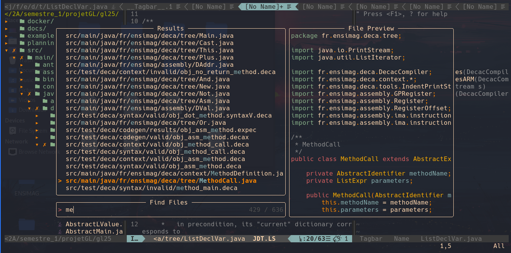

# You want to change the world ? Start by changing your text editor ...

## To configure neovim
- Put the `init.vim` and `coc-settings.json` in your `~/.config/nvim`
- On neovim run `:PlugInstall` and install the coc language server

⚠️ To get the icons, install a nerd font in your terminal

## To configure vim
- Put the `oldvim/vimrc` in your home and rename it `.vimrc`
- On vim run `:PlugInstall` and install the coc language server

⚠️ To get the icons, install a nerd font in your terminal

## Result
Read the `init.vim` and learn the key mapping.

For example, `Ctrl+P` opens the fuzzy finder and `Ctrl+L` opens the live grep.
(see picture below)

 

 

## Congratulation you are now a Vimmer 🎉🥳
- Be proud and delete Vscode and emacs or any other slow IDE
- Tell your friends to use vim (by force if necessary)
